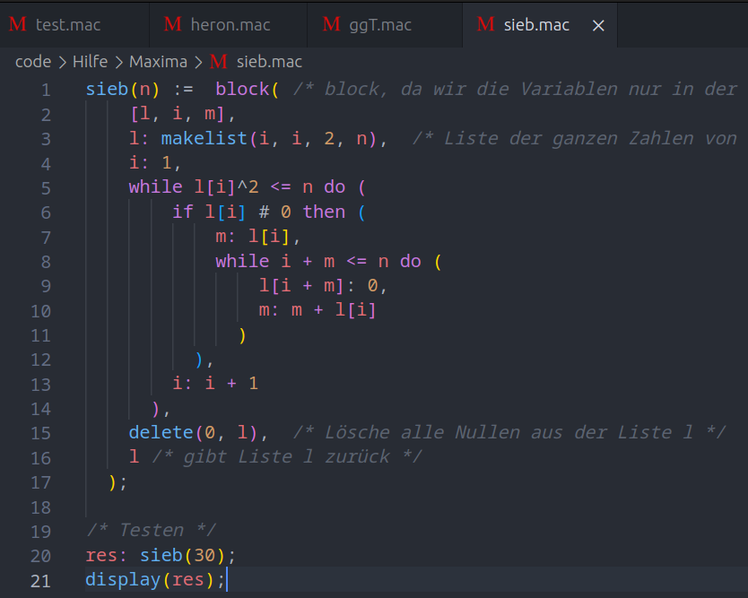

# Maxima Syntax Highlighting

You finally have language support for Maxima (.mac)! With this extension, your Maxima code becomes more visually appealing and readable, with different elements such as keywords, operators, functions, strings, numbers, variables, and comments highlighted in distinct colors. Additionally comes with an icon for
.mac files.
The extension provides an intuitive and customizable syntax highlighting experience, making it easier to spot errors, navigate code, and improve overall readability. Elevate your Maxima coding experience with this comprehensive syntax highlighting extension for Visual Studio Code.

Read more about Maxima here: https://maxima.sourceforge.io/

If you want to contribute to this (adding new keywords, change pattern recognision, etc.) here is the repository: https://github.com/nicoewok/maxima-syntax-highlighting
Every contribution is very welcome to help improve recognising everything Maxima has to offer!

Used theme: Atom One Dark Theme

### 1.0.0

Initial release of the Extension.
